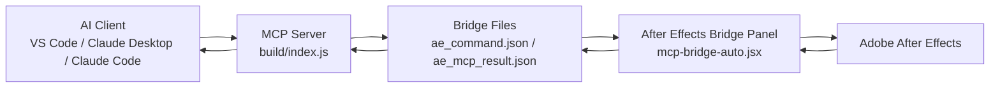
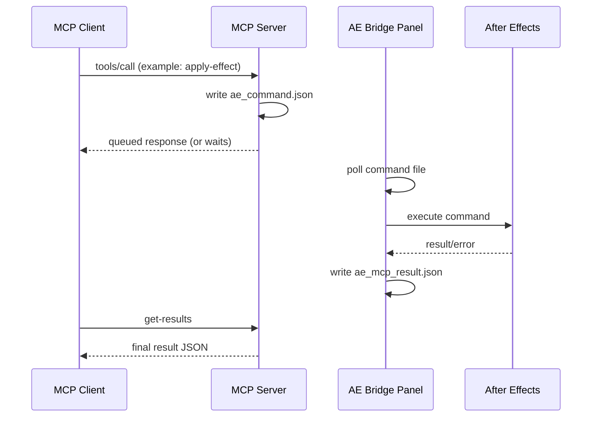

# After Effects MCP Server

[](https://nodejs.org/)
[](https://www.adobe.com/products/aftereffects.html)
[](#development)
[](LICENSE)

Control Adobe After Effects through MCP using a bridge panel running inside AE.
This project is optimized for practical automation workflows: effects, presets, keyframing, markers, and audio-aware tooling.

---

## Highlights

- Full composition and layer automation.
- Deep effect inspection and property editing.
- Advanced effect graph controls (temporal + spatial).
- Preset search/list/apply workflows.
- Marker and audio automation, including waveform-to-marker pipelines.
- Installed effect catalog discovery (`list-available-effects`).

## Feature Matrix

| Area | Capabilities |
|---|---|
| Composition | Create, inspect project/compositions, get clip frame ranges |
| Layers | Text/shape/solid/adjustment creation, transform/property updates, centering |
| Animation | Layer keyframes, expressions, effect keyframes with graph controls |
| Effects | Apply by name/matchName, list layer effects recursively, edit any effect property, remove effects |
| Presets | Apply `.ffx`, list/search preset libraries |
| Markers | Add single marker (comp/layer), add markers in bulk |
| Audio | Set channel levels, inspect audio metadata, analyze WAV waveform, detect peaks |

## Requirements

- Adobe After Effects
- Node.js 18+
- npm

In After Effects, enable:

- `Edit -> Preferences -> Scripting & Expressions -> Allow Scripts to Write Files and Access Network`

## Quick Start

1. Clone and install:

```bash
git clone https://github.com/TheLlamainator/after-effects-mcp.git
cd after-effects-mcp
npm install
```

2. Build:

```bash
npm run build
```

3. Install bridge script:

```bash
npm run install-bridge
```

4. Restart After Effects and open:

- `Window -> mcp-bridge-auto.jsx`
- Keep this panel open during MCP usage.

## MCP Client Config

Use an absolute path to `build/index.js`.

```json
{
  "mcpServers": {
    "AfterEffectsMCP": {
      "command": "node",
      "args": ["<absolute-path-to-repo>/build/index.js"]
    }
  }
}
```

## Add to VS Code

If you use an MCP-capable VS Code extension, add this server in that extension's MCP server settings.

Use:

- command: `node`
- args: `["<absolute-path-to-repo>/build/index.js"]`

Example snippet many extensions accept:

```json
{
  "mcpServers": {
    "AfterEffectsMCP": {
      "command": "node",
      "args": ["C:\\Users\\<you>\\Documents\\Projects\\AEMCP\\build\\index.js"]
    }
  }
}
```

Then:

1. Restart VS Code.
2. Open After Effects and keep `Window -> mcp-bridge-auto.jsx` open.
3. Call a simple tool like `get-help` or `run-script` with `getProjectInfo`.

## Add to Claude Desktop

Edit Claude Desktop config and add the MCP server entry.

Typical Windows config location:

- `%APPDATA%\\Claude\\claude_desktop_config.json`

Example:

```json
{
  "mcpServers": {
    "AfterEffectsMCP": {
      "command": "C:\\Program Files\\nodejs\\node.exe",
      "args": [
        "C:\\Users\\<you>\\Documents\\Projects\\AEMCP\\build\\index.js"
      ]
    }
  }
}
```

After saving:

1. Fully restart Claude Desktop.
2. Open AE bridge panel.
3. Verify with `tools/list` in logs or by calling a known tool.

## Add to Claude Code

Configure the same server command/args in your Claude Code MCP configuration.

Use this server definition:

```json
{
  "AfterEffectsMCP": {
    "command": "node",
    "args": ["<absolute-path-to-repo>/build/index.js"]
  }
}
```

Then:

1. Restart Claude Code or reload MCP servers.
2. Ensure After Effects is open with `mcp-bridge-auto.jsx` panel running.
3. Test with `get-results` after a queued command.

## Architecture Graph



## Command Flow Graph



## Typical Runtime Flow

1. Start your MCP client (it starts this server).
2. Keep AE bridge panel open.
3. Call tools.
4. If response says queued, call `get-results` after 1-3 seconds.

Note: some AE operations finish slightly after tool timeout windows; `get-results` usually contains the final state.

## Tool Catalog

### General

- `run-script`
- `get-results`
- `get-help`

### Composition and Layer Utilities

- `create-composition`
- `create-adjustment-layer`
- `center-layers`
- `get-layer-clip-frames`

### Effects and Presets

- `apply-effect`
- `add-any-effect`
- `mcp_aftereffects_applyEffect`
- `apply-effect-template`
- `list-layer-effects`
- `list-available-effects`
- `set-effect-property`
- `set-effect-keyframe`
- `remove-effect`
- `apply-preset`
- `list-presets`
- `search-presets`

### Markers and Audio

- `add-marker`
- `add-markers-bulk`
- `set-audio-levels`
- `get-audio-info`
- `analyze-audio-waveform`

### Diagnostics and Helpers

- `test-animation`
- `run-bridge-test`
- `mcp_aftereffects_get_effects_help`

## Audio to Marker Workflow

1. `get-audio-info` on target layer.
2. Copy `sourceFilePath`.
3. `analyze-audio-waveform` with optional `numPoints`.
4. Convert `peakTimes` to `markers[]`.
5. `add-markers-bulk`.

## Project Layout

- `src/index.ts` - MCP server and tool definitions
- `src/scripts/mcp-bridge-auto.jsx` - AE bridge panel
- `install-bridge.js` - bridge installer

## Development

Build:

```bash
npm run build
```

Install bridge:

```bash
npm run install-bridge
```

Run server directly:

```bash
node build/index.js
```

## Troubleshooting

### Server does not start

- Run `npm run build`.
- Check MCP logs for startup exceptions (for example duplicate tool registration).

### Commands queue but do not complete

- Ensure AE bridge panel is open.
- Confirm AE scripting/network permission is enabled.
- Retry and call `get-results` after a short delay.

### Results appear stale

- Reopen bridge panel.
- Send a new command and then call `get-results`.

### Program Files install fails

- Expected without elevated permissions.
- User AppData script paths are usually sufficient.

## License

MIT. See `LICENSE`.
